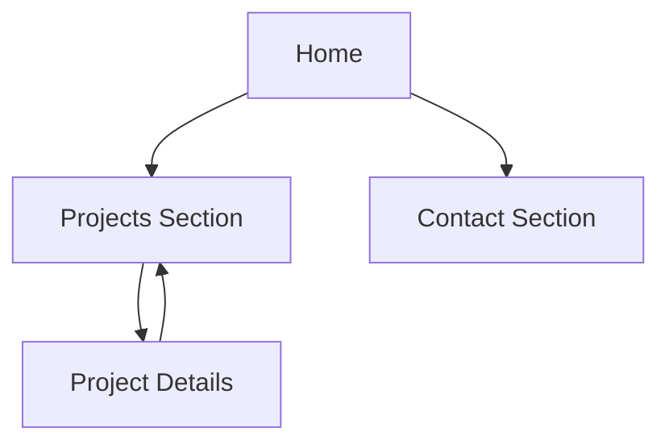

## 1. Product Overview
A fast, responsive web developer portfolio website to showcase your work, skills, and experience.
It helps recruiters/clients quickly evaluate you and contact you.

## 2. Core Features

### 2.1 Feature Module
The portfolio requirements consist of the following main pages:
1. **Home**: top navigation, hero/intro, about, skills, featured projects, experience, contact CTA.
2. **Project Details**: project overview, screenshots, tech stack, key features, links (live/demo + repo).

### 2.2 Page Details
| Page Name | Module Name | Feature description |
|-----------|-------------|---------------------|
| Home | Top navigation | Jump to sections (About/Skills/Projects/Experience/Contact); highlight current section on scroll (optional, CSS-only). |
| Home | Hero section | Introduce you with name/title, short summary, primary CTAs (View Projects, Download Resume, Contact). |
| Home | About section | Present bio placeholder text, location/timezone, and key strengths bullets. |
| Home | Skills section | List skills grouped by category (Frontend/Backend/Tools) using badges/chips. |
| Home | Projects section | Show a grid of project cards (title, thumbnail placeholder, 1–2 line summary, stack tags) linking to Project Details pages. |
| Home | Experience/Education section | Display timeline-style entries with role/school, dates, and achievement bullets placeholders. |
| Home | Contact section | Provide contact options (email mailto, LinkedIn, GitHub) and a simple message form UI (non-functional placeholder) with a clear note. |
| Project Details | Project hero | Show project name, short pitch, and primary links (Live Demo, GitHub). |
| Project Details | Media gallery | Display 1–3 screenshot placeholders and optional short GIF/video placeholder (image only). |
| Project Details | Case study content | Describe problem, your approach, key features, and what you learned (placeholders). |
| Project Details | Tech stack | Present stack list and role/contribution summary (solo/team). |
| Project Details | Navigation | Provide back-to-projects link and next/previous project links (static). |

## 3. Core Process
- Visitor lands on Home, scans hero and skills.
- Visitor reviews featured projects, then opens a Project Details page to assess impact, stack, and links.
- Visitor returns to Home and uses Contact section to reach you via email/social links (and optionally views a resume download).

