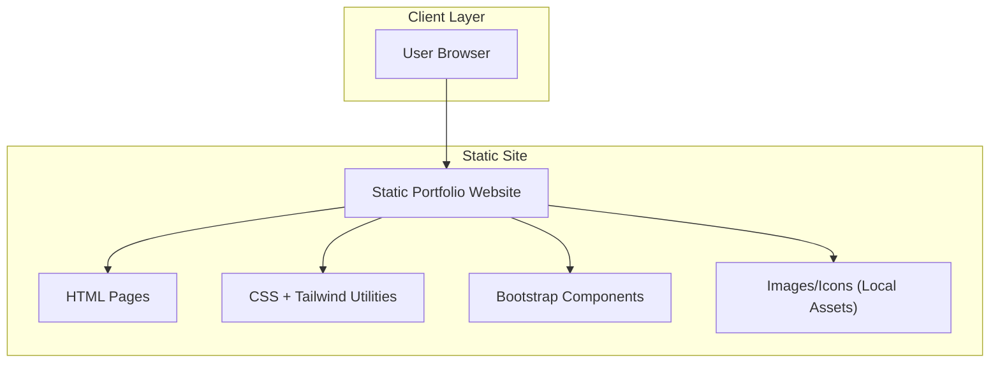

## 1.Architecture design

## 2.Technology Description
- Frontend: HTML5 + CSS3
- UI framework: Bootstrap@5 (layout grid + components)
- Utility styling: TailwindCSS@3 (utility classes for spacing/typography/colors)
- Backend: None

## 3.Route definitions
| Route | Purpose |
|-------|---------|
| / (index.html) | Home page with all core sections (About, Skills, Projects, Experience, Contact). |
| /projects.html (optional) | Dedicated list of all projects (if you prefer not to keep everything on Home). |
| /project-<slug>.html | Static project detail pages (one per project). |

## 6.Data model(if applicable)
Not applicable (static site; no database).
